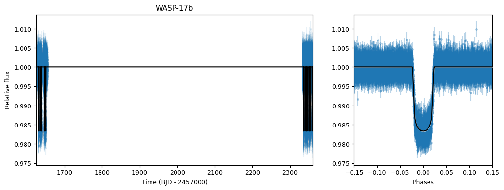

# Transit Fitting for Stellar Parameters: Can Exoplanet Transits Improve Our Understanding of Host Star Properties?
## MSc Research Project in Astrophysics at UCL - Ximing Xu
### Overview
This repository contains the code and analysis pipeline for my MSc research project, supervised by Dr. Vincent Van Eylen. This research aims to investigate whether the presence of transiting exoplanets can contribute to a better understanding of the characteristics of their host stars.

- The first part of the project focuses on fitting the TESS light curves of known transiting exoplanets to constrain key transit parameters such as the planet-to-star radius ratio, impact parameter, and stellar density.
- The second part focuses on stellar modeling, which uses the stellar density obtained from transit fitting, combined with additional host star data from the NASA Exoplanet Archive, to improve the characterization of the host stars.

### Methodology
In the transit fitting part, the `lightkurve` package was used to process the TESS light curve data. This included normalizing the flux, removing outliers, and combining data from multiple data sectors. Then, the `juliet` package was used to fit the light curve and constrain exoplanet parameters such as planet-to-star radius ratio and the stellar density of their host stars.

In the stellar modelling part, the `basta` package was used to perform stellar modelling of each host star based on three models. These models share 7 common input parameters (starid, longitude, latitude, parallax, parallax_err, G_Gaia, G_Gaia_err), along with their own specific inputs as shown below.

- Light curve-based model (rho, rho_err)
- Spectroscopy-based model (Teff, Teff_err, FeH, FeH_err)
- Combined model (Teff, Teff_err, FeH, FeH_err, rho, rho_err)

The stellar density data are obtained from the transit fitting part, while the remaining stellar parameters — including galactic coordinates, parallax, Gaia magnitude, effective temperature, and metallicity — can be found in the NASA Exoplanet Archive. When the results from the light curve-based model and the spectroscopy-based model are consistent (i.e., the stellar density derived from light curve fitting is reliable), the combined model can better constrain the stellar parameters.

### Dependencies
This project consists of two main components: transit fitting and stellar modelling, each using different sets of code and dependencies.  

- The transit fitting scripts are developed and tested with Python 3.11. Required packages are listed in the requirements.txt file.
- The stellar modelling part uses `basta` version 1.5.3. It is highly recommended to run `basta` in a fresh virtual  environment (e.g., Google Colab). Before running the main code, please upload the corresponding model `.py` file and the target `.ascii` file, also make sure the file paths are correct.

### Sample Output
Transit Fitting Result for WASP-17b

  

Stellar Modelling Result for WASP-17 (Combined Model)

  

### References
- Lightkurve Collaboration, Cardoso, J. V. d. M., Hedges, C., et al. 2018, Lightkurve: Kepler and TESS time series analysis in Python, Astrophysics Source Code Library, record ascl:1812.013
- Espinoza, N., Kossakowski, D., & Brahm, R. 2019, MNRAS, 490, 2262, doi: 10.1093/mnras/stz2688
- Kreidberg, L. 2015, Publications of the Astronomical Society of the Pacific, 127, 1161–1165, doi: 10.1086/683602
- Speagle, J. S. 2020, MNRAS, 493, 3132, doi: 10.1093/mnras/staa278
- Foreman-Mackey, D. 2016, The Journal of Open Source Software, 1, 24, doi: 10.21105/joss.00024
- Silva Aguirre, V., Davies, G. R., Basu, S., et al. 2015, Monthly Notices of the Roya Astronomical Society, 452, 2127–2148, doi: 10.1093/mnras/stv1388
- Aguirre Børsen-Koch, V., Rørsted, J. L., Justesen, A. B., et al. 2021, Monthly Notices of the Roya Astronomical Society, 509, 4344–4364, doi: 10.1093/mnras/stab2911
- BASTA source code: https://github.com/BASTAcode/BASTA
- Note: In the stellar modeling section, the codes for all three models are based on the [BASTA documentation example】(https://github.com/BASTAcode/BASTA/blob/main/examples/create_inputfile.py), with specific parameters adjusted for this study.
